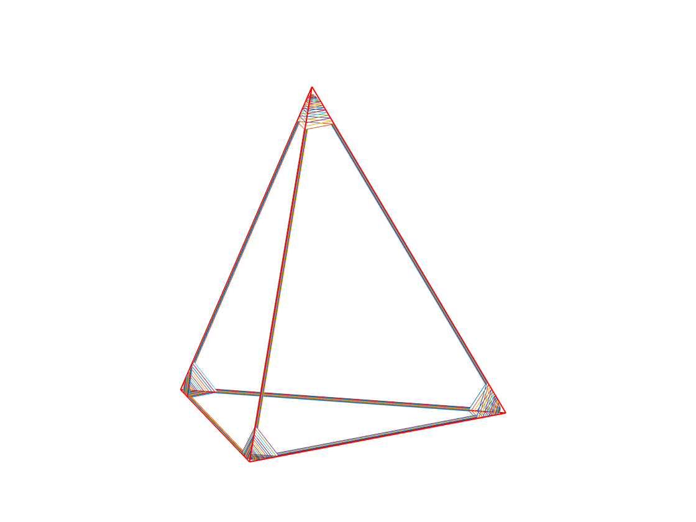

## Polyhedral smoothing in MATLAB

The code is divided into three main applications:

### Smoothing 1-dimensional objects in the plane

The driver file **polygon_test.m** constructs rounding of regular
n-gons. It is easily adaptable to other polygons, only vertex
locations are needed. The resulting polygons are automatically
plotted.

The main routines used are `smthabv(h,k,n)` and `smthpoly(v,h,k,m)`.

The file [smthabhv.m](src/smthabhv.m) contains a function which
returns 2n equispaced samples of the convolution of a compactly
supported kernel (1-(x/h)^2)^k on [-1,1] with the function abs(x).

The file [smthpoly.m](src/smthpoly.m) smooths a polygon with vertices
listed in the variable `v`. The other parameters `h,k,m` specify the
smoothness of the resulting smoothed vertices and the number of sample
points therein.

### Smoothing 2-dimensional objects in 3-space.

The driver file **polyhedron_test.m** constructs rounding of various
polyhedron, including
It is easily adaptable to other polyhedrons, only vertex, edges, and
face information is needed. A carcass of the resulting polyhedron is
plotted automatically.

The main routines used are `polyframe()`, `smthvrtx()`,
and `smthedge()`.

- polyframe(V,E,F) takes a polyhedron with vertices in V and edges and
   faces described in E and F respectively and returns data structures
   describing the local geometry of vertices, edges and faces. For
   example, for each vertex we get a list of the other vertices joined
   to the given vertex by an edge, and a choice of outer point unit
   vector at the vertex, and the faces that define each edge. This
   facilitates the computations used to smooth the polyhedron.
- smthvrtx(i,V,E,Vout,Fout,he,ke,hv,kv,me,mv) This program smooths the
   polyhedron near to the vertex i. As before (V,E,Vout, Fout) are
   geometric and combinatorial information about the polyhedron and
   (he,ke,hv,kv,me,mv) are parameters that specify the smoothing of
   the edges, (he,ke), and vertices, (hv,kv), as well as the number of
   samples returned on the smoothed objects (me,mv).
- smthedge(v0,v1,nv0,nv1,mv0,mv1,lmin0,lmin1,h,k,ne,nh) is a program
   that smooths the edges of polyhedra. This program assumes that the
   vertices have already been smoothed, and the variables
   (lmin0,lmin1) describe the size of the region along edge modified
   in the vertex smoothing step.

These programs are called by smth_polyhedron_tst.m, which contains the
data needed to define the platonic solids (but not the dodecahedron).

### Plotting

There are several utility plotting rountines:
- [pltsmvx.m](src/pltsmvx.m) plots samples of a smoothed vertex
- [pltsmed.m](src/pltsmed.m) plots samples of a smoothed edge
- [pltpoly.m](src/pltpoly.m) plots the edges and vertices of a polyhedron

